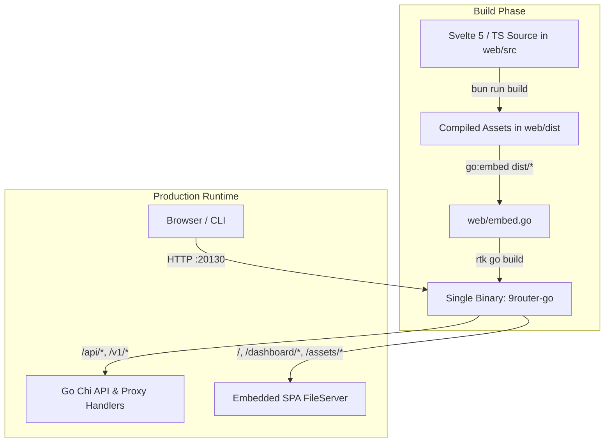

# 9router-go Native Embedded Dashboard: Migration & Architecture Guide
*(Dokumentasi Migrasi & Arsitektur Dashboard Native Embedded 9router-go)*

> **Bahasa**: Bilingual (Bahasa Indonesia & English)  
> **Status Proyek**: Active / Production Ready  
> **Target Rilis**: 9router-go v0.7.0+

---

## Daftar Isi / Table of Contents
1. [Ringkasan & Arsitektur Utama (Overview & Core Architecture)](#1-ringkasan--arsitektur-utama-overview--core-architecture)
   - [Single Binary Embedded Architecture](#11-single-binary-embedded-architecture)
   - [Eliminasi Node.js Runtime di Production](#12-eliminasi-nodejs-runtime-di-production)
   - [Modern Frontend Stack: Svelte 5 + Tailwind CSS v4](#13-modern-frontend-stack-svelte-5--tailwind-css-v4)
   - [Backend Dependency Injection (Uber Fx) & Configuration (Viper)](#14-backend-dependency-injection-uber-fx--configuration-viper)
   - [Prinsip Modularitas Ketat (Strict Modularity Rules)](#15-prinsip-modularitas-ketat-strict-modularity-rules)
2. [Status Implementasi & Milestone Checklist (Progress Tracker)](#2-status-implementasi--milestone-checklist-progress-tracker)
   - [Phase 1: Uber Fx DI & Viper Config](#phase-1-uber-fx-dependency-injection--viper-config-env-integration)
   - [Phase 2: Client-Side SPA Router (HTML5 History & popstate)](#phase-2-client-side-spa-router-dengan-html5-history-api--popstate)
   - [Phase 3: Freebuff Provider, OAuth Device Flow & Session Status API](#phase-3-freebuff-provider-oauth-device-flow--session-status-api)
   - [Phase 4: Strict Model Assignment & Multi-Account Model Binding](#phase-4-strict-model-assignment--multi-account-model-binding)
   - [Phase 5: Combos Modal Redesign & Nested Routing](#phase-5-combos-modal-redesign--nested-routing)
   - [Phase 6: Pemisahan Format Chat/LLM vs Media Providers](#phase-6-pemisahan-format-chatllm-vs-media-providers)
3. [Struktur Berkas Utama (Key File Structure)](#3-struktur-berkas-utama-key-file-structure)
   - [Frontend Components Directory (`web/src/components/`)](#31-frontend-components-directory)
   - [Frontend Library & Routing (`web/src/lib/`)](#32-frontend-library--routing)
   - [Backend Modules (`internal/app/` & `internal/handlers/`)](#33-backend-modules)
4. [Panduan Build & Deploy (Build & Run Guide)](#4-panduan-build--deploy-build--run-guide)
   - [Prasyarat (Prerequisites)](#41-prasyarat-prerequisites)
   - [Langkah Build Frontend (Frontend Build Steps)](#42-langkah-build-frontend-frontend-build-steps)
   - [Langkah Kompilasi Binary Go (Go Binary Compilation)](#43-langkah-kompilasi-binary-go-go-binary-compilation)
   - [Menjalankan Gateway (Running the Gateway)](#44-menjalankan-gateway-running-the-gateway)
   - [Verifikasi & Healthcheck (Verification & Healthcheck)](#45-verifikasi--healthcheck-verification--healthcheck)
5. [Rencana Selanjutnya / Next Steps (Roadmap)](#5-rencana-selanjutnya--next-steps-roadmap)

---

## 1. Ringkasan & Arsitektur Utama (Overview & Core Architecture)

### 1.1 Single Binary Embedded Architecture
**Indonesian:**  
Sebelumnya, dashboard administratif sering membutuhkan proses terpisah (misalnya server Node.js/Next.js) atau web server proxy eksternal (Nginx). Dalam arsitektur baru ini, seluruh aplikasi Single Page Application (SPA) dikompilasi menjadi static assets yang langsung disematkan (*embedded*) ke dalam binary Go executable menggunakan fitur standar Go `//go:embed dist/*` pada paket `web/embed.go`.

**English:**  
Previously, administrative dashboards often required a separate daemon (e.g., Node.js/Next.js runtime) or an external reverse proxy (Nginx). In this new architecture, the entire Single Page Application (SPA) is compiled into optimized static assets and directly embedded inside the compiled Go binary using standard `//go:embed dist/*` in `web/embed.go`.



### 1.2 Eliminasi Node.js Runtime di Production
- **Zero Node.js dependency at runtime**: Server produksi hanya membutuhkan file biner tunggal `9router-go` dan database SQLite lokal. Tidak ada Node.js, `npm`, `pnpm`, ataupun Bun yang berjalan di server.
- **Portability**: Biner dapat langsung dijalankan di sistem operasi Linux, macOS, atau Windows tanpa setup environment JavaScript.
- **Memory footprint**: Mengurangi konsumsi memori produksi hingga >150 MB (menghilangkan overhead V8 runtime).

### 1.3 Modern Frontend Stack: Svelte 5 + Tailwind CSS v4
- **Svelte 5 Runes**: Memanfaatkan reaktivitas modern Svelte 5 (`$state`, `$derived`, `$props`, `$effect`, dan `$bindable`) untuk manajemen state yang presisi, performa tinggi, dan tanpa overhead virtual DOM.
- **Tailwind CSS v4 Dark Mode**: Sistem tema modern dengan CSS variables dan palette gelap terintegrasi (`bg-surface`, `border-border`, `text-text-main`, `brand-500`).
- **Lucide Icons (`lucide-svelte`)**: Ikon SVG ringan dan konsisten di seluruh navigasi dan indikator model.
- **Vite & Bun**: Perkakas build kilat dengan module bundler modern dan HMR saat pengembangan lokal.

### 1.4 Backend Dependency Injection (Uber Fx) & Configuration (Viper)
- **Uber Fx (`go.uber.org/fx`)**:
  Seluruh lifecycle server, database repo, handler HTTP, dan background workers dikelola menggunakan declarative Dependency Injection:
  - `ConfigModule`: Menyediakan konfigurasi Viper dan parsing file `.env`.
  - `DatabaseModule`: Menyediakan koneksi SQLite dan `*db.Repo`.
  - `HandlersModule`: Menginisialisasi seluruh router Chi dan HTTP handlers.
  - `ServerModule`: Mengelola lifecycle `*http.Server`, graceful shutdown, catalog sync background, dan updater background.
- **Viper Configuration (`github.com/spf13/viper`)**:
  Mendukung pembacaan konfigurasi otomatis dari `.env` dengan fallback default yang aman (Port 20130, salt otentikasi, RTK token saver flag).

### 1.5 Prinsip Modularitas Ketat (Strict Modularity Rules)
**Indonesian:**  
Untuk menjaga kemudahan pemeliharaan jangka panjang dan menghindari "god components", setiap file subkomponen diwajibkan memiliki ukuran baris maksimal $\le 300$ baris kode (*Strict Modularity Rule*). Komponen yang kompleks dipecah menjadi subkomponen independen dan helper file terpisah (contoh: `pickerData.ts`, `CapacityAdapterSection.svelte`, `ModelPill.svelte`).

**English:**  
To prevent maintenance bottlenecks and "god components", every single subcomponent file must adhere to a strict line-count budget of $\le 300$ lines. Complex views are cleanly decomposed into isolated subcomponents and data helpers (e.g., `pickerData.ts`, `CapacityAdapterSection.svelte`, `ModelPill.svelte`).

---

## 2. Status Implementasi & Milestone Checklist (Progress Tracker)

| Fase / Phase | Status | Deskripsi Ringkas / Summary |
| :--- | :---: | :--- |
| **Phase 1** | [x] Selesai | Uber Fx Dependency Injection & Viper Config (`.env` integration) |
| **Phase 2** | [x] Selesai | Client-Side SPA Router dengan HTML5 History API & `popstate` event |
| **Phase 3** | [x] Selesai | Freebuff Provider, OAuth Device Flow & Session Status API (`/api/oauth/freebuff/session`) |
| **Phase 4** | [x] Selesai | Strict Model Assignment & Multi-Account Model Binding (mencegah error 409 `model_locked`) |
| **Phase 5** | [x] Selesai | Combos Modal Redesign (Combos pills di atas, nested combos, capability badges 👁️/🧠) |
| **Phase 6** | [x] Selesai | Pemisahan Format Chat/LLM vs Media Providers (Accordion Media, Embedding, TTS, STT, Image, Video, Web) |

---

### Phase 1: Uber Fx Dependency Injection & Viper Config (.env integration)
- **Tujuan**: Menggantikan inisialisasi manual monolitik pada `cmd/9router-go/main.go` dengan arsitektur DI yang modular, testable, dan terstruktur rapi.
- **Implementasi**:
  - `internal/app/app.go`: Menggabungkan `AppModule` dan fungsi `Run(fxApp *fx.App)` untuk graceful signal handling (`SIGINT`, `SIGTERM`).
  - `internal/app/config.go`: Menyediakan `*config.Config` melalui `config.NewViper()`.
  - `internal/app/database.go`: Menyediakan koneksi SQLite dan instance `*db.Repo`.
  - `internal/app/handlers.go`: Menyediakan `http.Handler` dari router Chi utama.
  - `internal/app/server.go`: Mengonfigurasi `*http.Server` dan lifecycle hooks `OnStart` dan `OnStop`.
  - `internal/config/config.go`: Menghubungkan Viper ke file `.env` dengan fallback environment variables.

---

### Phase 2: Client-Side SPA Router dengan HTML5 History API & popstate
- **Tujuan**: Menyediakan navigasi instan tanpa refresh halaman penuh, dengan sinkronisasi URL browser yang ramah bookmark dan reload langsung.
- **Implementasi Frontend (`web/src/lib/router.ts` & `App.svelte`)**:
  - `ActiveTab` type union: `'analytics' | 'combos' | 'connections' | 'settings' | 'keys' | 'terminal' | 'media-embedding' | 'media-image' | 'media-tts' | 'media-stt' | 'media-video' | 'media-web'`.
  - `TAB_ROUTES` dan `ROUTE_TO_TAB` dictionaries memetakan URL path ke tab aktif.
  - `pathToTab(pathname)`: Normalisasi route yang toleran terhadap format URL lama dan baru.
  - `window.history.pushState` & `window.history.replaceState` untuk update URL tanpa page reload.
  - `window.addEventListener('popstate', handlePopState)` untuk tombol Back/Forward browser.
- **Implementasi Backend (`web/embed.go` & `internal/handlers/router.go`)**:
  - Fallback handler menyajikan `index.html` untuk route navigasi client-side, namun mengembalikan status HTTP 404 jika file asset berekstensi (`.js`, `.css`, `.png`) tidak ditemukan.
  - Mendaftarkan rute dashboard eksplisit pada Chi router (`/`, `/dashboard`, `/dashboard/*`, `/connections`, `/combos`, `/media-providers/*`, dll.).

---

### Phase 3: Freebuff Provider, OAuth Device Flow & Session Status API
- **Tujuan**: Mengintegrasikan provider Freebuff dengan otentikasi Device Code Flow OAuth dan tracking kuota sesi aktif.
- **Implementasi**:
  - Endpoint Backend:
    - `POST /api/oauth/freebuff/poll`: Polling token Freebuff selama device flow berlangsung.
    - `GET /api/oauth/freebuff/session`: Mengambil status sesi aktif langsung dari Freebuff upstream (`/api/v1/freebuff/session`).
  - File handler backend: `internal/handlers/oauth/freebuff_session.go` & `internal/proxy/executor/freebuff_session.go`.
  - Komponen Frontend: `web/src/components/connections/FreebuffSessionBanner.svelte` yang menampilkan status login, sisa waktu sesi, dan indikator aktif/kedaluwarsa.

---

### Phase 4: Strict Model Assignment & Multi-Account Model Binding
- **Tujuan**: Mencegah kegagalan runtime (HTTP 409 `model_locked`) ketika beberapa akun/koneksi dari satu provider dibatasi hanya untuk model tertentu (misal akun A untuk `gpt-4o`, akun B untuk `o3-mini`).
- **Implementasi**:
  - Logika filtering `filterConnectionsForModel` di `internal/handlers/chat/connections.go`.
  - Mendukung pembacaan `assignedModel` dan `freebuffModel` baik di level root `Data` maupun di dalam `providerSpecificData`.
  - Membaca konfigurasi `ProviderStrategies[provider].StrictModelAssignment` di tabel settings.
  - Jika `StrictModelAssignment` aktif, request hanya akan diarahkan ke koneksi yang modelnya cocok secara eksklusif.
  - Didukung dengan unit test komprehensif pada `internal/handlers/chat/strict_model_test.go`.

---

### Phase 5: Combos Modal Redesign & Nested Routing
- **Tujuan**: Mendesain ulang modal pemilihan model untuk pembuatan combo routing cerdas (fallback, round-robin, fusion).
- **Fitur Utama**:
  1. **Combos Pills di Bagian Paling Atas**: Bagian "Combos" diletakkan di urutan pertama pada `ModelPickerModal.svelte`, memungkinkan pembuatan *nested combos* (combo di dalam combo).
  2. **Capability Badges**:
     - 👁️ **Vision Badge**: Menandai model yang mendukung input gambar (`caps.vision = true`).
     - 🧠 **Reasoning / Thinking Badge**: Menandai model dengan kemampuan penalaran mendalam (`caps.reasoning = true`).
  3. **Bulk Toggle Selection**: Klik sekali untuk menambahkan model, klik kedua untuk menghapusnya langsung dari combo.
  4. **Pemisahan Logika & Tampilan**: Seluruh transformasi data diekstrak ke `pickerData.ts` sehingga template modal tetap di bawah batasan 300 baris kode.

---

### Phase 6: Pemisahan Format Chat/LLM vs Media Providers
- **Tujuan**: Memisahkan antarmuka LLM Chat murni dari model multimodal/media (Embedding, Image, Voice, Video, Web Scraping) agar dashboard teratur dan tidak membingungkan pengguna.
- **Implementasi**:
  - **Sidebar Accordion**: Menu "Media Providers" di `web/src/components/Sidebar.svelte` dengan status toggle buka/tutup dan submenu:
    - 🔢 **Embedding** (`/dashboard/media-providers/embedding`)
    - 🎨 **Text to Image** (`/dashboard/media-providers/image`)
    - 🔊 **Text To Speech (TTS)** (`/dashboard/media-providers/tts`)
    - 🎙️ **Speech To Text (STT)** (`/dashboard/media-providers/stt`)
    - 🎬 **Video** (`/dashboard/media-providers/video`)
    - 🌐 **Web Fetch & Search** (`/dashboard/media-providers/web`)
  - **Catalog Filtering**:
    - Fungsi `isChatProvider(p)` di `web/src/lib/providers.ts` memastikan hanya provider bertipe `llm` yang muncul di menu utama `/dashboard/providers`.
    - `pickerData.ts` mengecualikan media provider dari pemilihan model chat combo.
  - **Komponen Tampilan Khusus**: `MediaKindView.svelte`, `MediaWebView.svelte`, `MediaProviderCard.svelte`, dan `MediaModelCard.svelte`.

---

## 3. Struktur Berkas Utama (Key File Structure)

```
9router-go/
├── cmd/
│   └── 9router-go/
│       └── main.go                      # Entry point CLI (Fx app bootstrap)
├── internal/
│   ├── app/                             # Uber Fx DI Modules
│   │   ├── app.go                       # AppModule definition & Run()
│   │   ├── config.go                    # ConfigModule (Viper injection)
│   │   ├── database.go                  # DatabaseModule (SQLite & db.Repo)
│   │   ├── handlers.go                  # HandlersModule (HTTP Chi router)
│   │   ├── params.go                    # CLIParams struct
│   │   └── server.go                    # ServerModule (*http.Server & hooks)
│   ├── config/
│   │   └── config.go                    # Viper configuration loader (.env support)
│   └── handlers/
│       ├── router.go                    # Main HTTP routes & static web handler
│       ├── chat/                        # Chat completion, Combos & Strict Model routing
│       │   ├── combo.go                 # Combo execution & failover
│       │   ├── connections.go           # filterConnectionsForModel implementation
│       │   └── strict_model_test.go     # Unit tests for strict model binding
│       ├── dashboard/                   # Dashboard REST API handlers
│       │   ├── connections.go           # Provider connection CRUD
│       │   ├── combos.go                # Combo configuration CRUD
│       │   ├── apikeys.go               # Virtual API Keys management
│       │   └── settings.go              # Quota & Token Saver settings
│       ├── media/                       # Multimodal handlers (embeddings, image, audio, web)
│       │   └── media.go
│       └── oauth/                       # OAuth handlers (Freebuff & Antigravity)
│           ├── freebuff.go
│           └── freebuff_session.go      # Freebuff active session status API
├── web/
│   ├── embed.go                         # Go embedded FS (//go:embed dist/*) & fallback
│   ├── package.json                     # Bun/Vite configuration
│   ├── vite.config.ts                   # Vite bundler configuration
│   └── src/
│       ├── App.svelte                   # Main dashboard layout & SPA state manager
│       ├── main.ts                      # Svelte mounting script
│       ├── api/
│       │   └── client.ts                # Strongly typed HTTP API client
│       ├── lib/
│       │   ├── router.ts                # Client-side route mappings & helpers
│       │   ├── providers.ts             # Provider catalog, kinds & isChatProvider filter
│       │   ├── models.ts                # Model helpers & capability parser
│       │   └── ui/                      # Base UI design system components (Badge, Button, Card)
│       └── components/
│           ├── Sidebar.svelte           # Left navigation bar with Media Accordion
│           ├── TopBar.svelte            # Header bar with connection metrics & theme toggle
│           ├── connections/             # Provider management subcomponents
│           │   ├── ConnectionsView.svelte
│           │   ├── ProvidersOverviewGrid.svelte
│           │   ├── ProviderCard.svelte
│           │   ├── ConnectionRow.svelte
│           │   ├── AvailableModelsCard.svelte
│           │   └── FreebuffSessionBanner.svelte
│           ├── combos/                  # Combo builder & routing subcomponents
│           │   ├── CombosView.svelte
│           │   ├── ModelPickerModal.svelte
│           │   ├── ModelPill.svelte     # Model badge with 👁️ Vision & 🧠 Reasoning
│           │   ├── pickerData.ts        # Data filtering and grouping logic (<= 300 LOC)
│           │   └── CapacityAdapterSection.svelte
│           └── media/                   # Multimodal media provider views
│               ├── MediaKindView.svelte
│               ├── MediaWebView.svelte
│               ├── MediaProviderCard.svelte
│               ├── MediaModelCard.svelte
│               └── mediaTypes.ts
└── docs/
    └── BUILD_DASHBOARD.md               # File dokumentasi ini (Architecture & Guide)
```

---

## 4. Panduan Build & Deploy (Build & Run Guide)

### 4.1 Prasyarat (Prerequisites)
Pastikan lingkungan Anda memiliki perkakas berikut:
- **Go**: versi 1.23+ atau lebih baru.
- **Bun**: versi 1.1+ (atau Node.js 20+ jika menggunakan npm/pnpm).
- **RTK (Rust Token Killer)**: perkakas pembantu build opsional untuk efisiensi token.

### 4.2 Langkah Build Frontend (Frontend Build Steps)
Kompilasi asset frontend dari direktori `web/` ke folder `web/dist/`:

```bash
# Masuk ke direktori web
cd web

# Install dependensi frontend
bun install

# Jalankan linter dan unit test (opsional)
bun run test

# Kompilasi static production bundle ke web/dist/
bun run build

# Kembali ke direktori root proyek
cd ..
```

*Catatan: Pastikan direktori `web/dist/index.html` telah terbuat sebelum melanjutkan ke kompilasi biner Go.*

### 4.3 Langkah Kompilasi Binary Go (Go Binary Compilation)
Kompilasi source Go dengan asset web yang tertanam langsung:

```bash
# Menggunakan RTK (rekomendasi repo):
rtk go build -o 9router-go ./cmd/9router-go

# Atau menggunakan standard Go toolchain:
go build -o 9router-go ./cmd/9router-go
```

### 4.4 Menjalankan Gateway (Running the Gateway)
Jalankan file biner yang telah dikompilasi:

```bash
# Menjalankan gateway secara langsung
./9router-go
```

Secara default, 9router-go akan mendengarkan di port `20130`.  
Buka browser dan akses dashboard di:
👉 **`http://localhost:20130/`** atau **`http://localhost:20130/dashboard`**

Untuk menjalankan pada port khusus atau menggunakan konfigurasi tertentu, Anda dapat menyediakannya melalui `.env` atau flag environment:
```bash
PORT=8080 ./9router-go
```

### 4.5 Verifikasi & Healthcheck (Verification & Healthcheck)
Anda dapat memverifikasi status gateway menggunakan `curl`:

```bash
# Periksa health status gateway
curl -i http://localhost:20130/health
# Respons: HTTP/1.1 200 OK -> {"status":"ok"}

# Periksa status dashboard endpoint
curl -i http://localhost:20130/api/hello
# Respons: HTTP/1.1 200 OK -> {"status":"ok","message":"hello"}

# Periksa routing embedded asset
curl -I http://localhost:20130/dashboard/providers
# Respons: HTTP/1.1 200 OK (Content-Type: text/html; charset=utf-8)
```

---

## 5. Rencana Selanjutnya / Next Steps (Roadmap)

1. **Auto-Discovery & Dynamic Probe Engine**:
   - Integrasi pengecekan latensi otomatis (*health probe*) untuk provider yang aktif secara berkala pada background worker.
   - Penandaan otomatis model yang mengalami degradasi kuota / rate-limit langsung di dashboard UI.

2. **WebSockets / Server-Sent Events (SSE) Metric Live Stream**:
   - Menggantikan polling interval 3 detik pada `App.svelte` dengan koneksi real-time SSE untuk metrik request langsung, log terminal, dan perubahan status koneksi.

3. **Media Provider Playground**:
   - Menambahkan interactive testing playground untuk halaman Media (misal: input prompt untuk Text to Image atau audio player untuk preview Text to Speech langsung di dashboard).

4. **Multi-User RBAC & Granular Virtual Keys**:
   - Memperluas fitur Virtual API Keys dengan kuota berbasis anggaran per model, per tag, dan pembatasan IP whitelist.

5. **Backup & Export Configuration**:
   - Fitur ekspor/impor seluruh konfigurasi connections, combos, dan settings ke dalam file JSON/YAML terenkripsi langsung dari UI Dashboard.

---
*Dokumen ini dibuat dan dikelola sebagai standar arsitektur resmi untuk pengembangan Native Embedded Dashboard 9router-go.*
